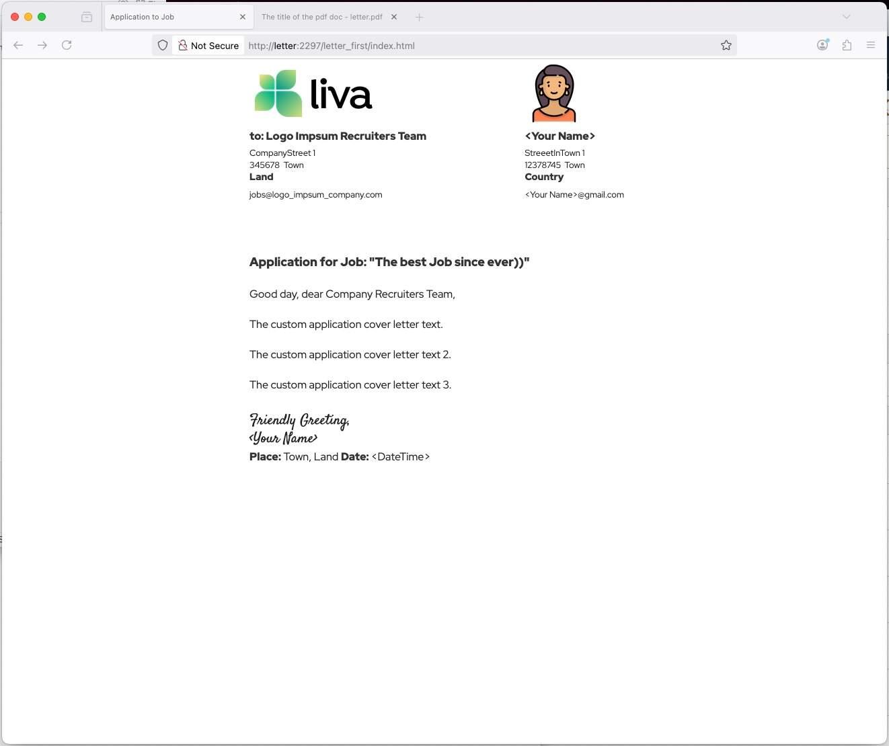
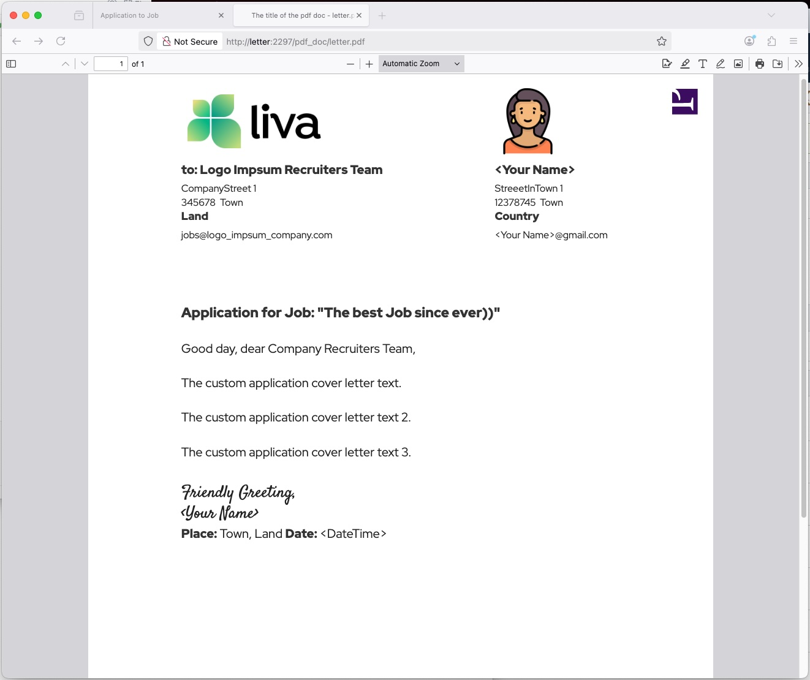
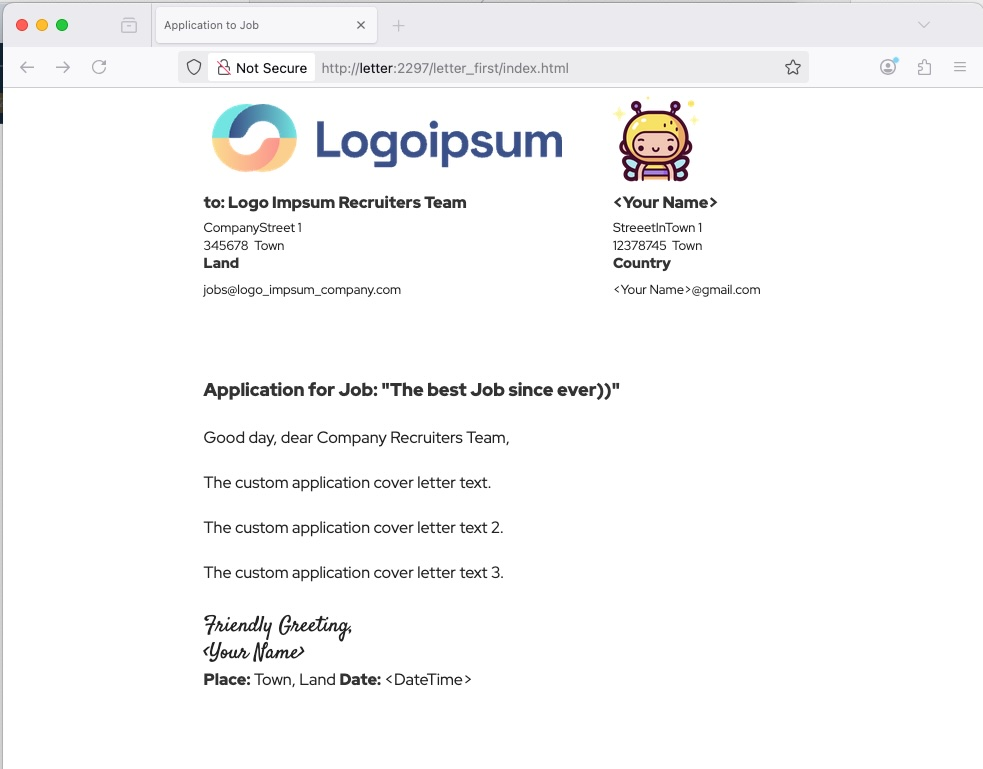
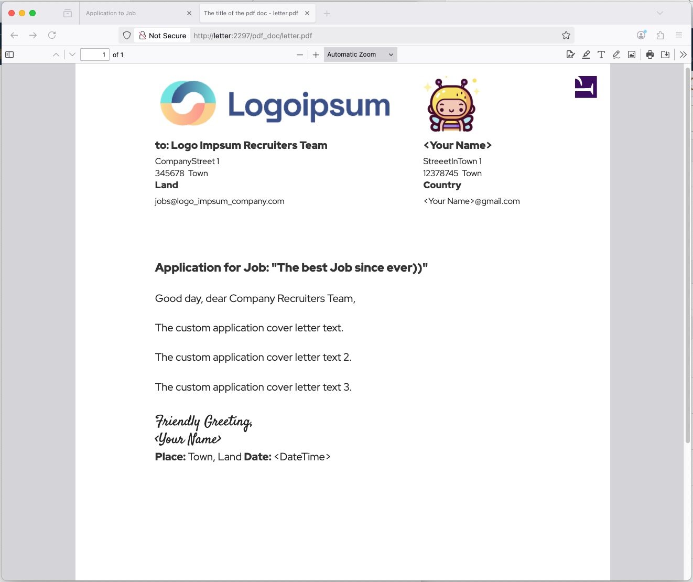

# Cover Letter in .html save as .pdf doc












## START HTTPS ENDPOINT ON YOUR MACHINE


### Register local url

in the file `/etc/hosts` add Your machine's local IPv4 address *127.0.0.1* and the host name *letter* like this:

```
127.0.0.1    letter
```

or, in the Terminal with Your machine's user password like this:

```bash
# propmpts password to authorize:
sudo -s

# adds mapping of the IPv4 to the host name for Your browsers on Your machine.
echo "127.0.0.1    letter" >> /etc/hosts 
```


The host name has to be equal to the name of the dockerized service Jaisocx Sites Server in the `docker-compose.yml` on *line 3*. This host name is requested by the PrinceXML service, and has to be the dockerized service name, when converting html page to a pdf doc in the script `command/genPdf.sh` on *line 3*: 

```
... prince http://letter/ ...
```


The Jaisocx Sites Server sends site to browser when the host name matches the domain name in the conf on *line 10*:

```
<domain name="letter"
```


### Start dockerized services: sites server, php, pdf lib PrinceXML

#### Finer is like this:

1. First build services one after one and bugfix errors.


*if princexml container error "architecture mismatch"
try other package, commented in the 
docker/princexml/Dockerfile, lines 25-27*

```
docker compose build php
docker compose build http
docker compose build princexml
```


2. Try to start all dockerized services and the docker network 

```
docker-compose up -d
```


3. Navigate to:

[http://letter:2297/](http://letter:2297/)


## GEN PDF

1. Review the Terminal script `command/genPdf.sh`. There You can set the passwords, Pdf doc name, Your name as the pdf doc's author.


2. Gen pdf doc via command in the Terminal:

```bash
./command/genPdf.sh
```


## WHERE IS THE .PDF DOC

the .pdf doc is here:


[pdf-output/letter.pdf](pdf-output/letter.pdf)

[http://letter:2297/pdf_doc/](http://letter:2297/pdf_doc/)


```
${project_root}/pdf-output/letter.pdf
```


#### Friendly greetings

Jaisocx Software Architect

Elias

tech@jaisocx.com

